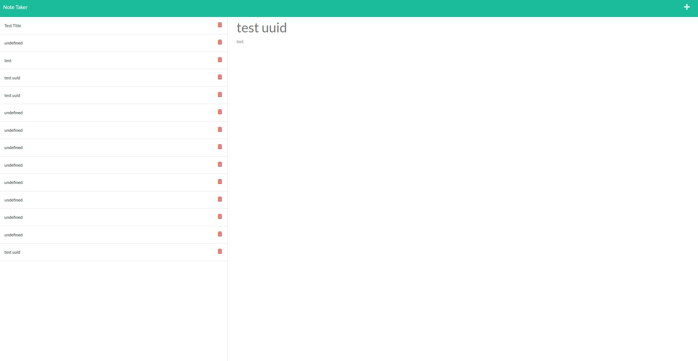

 # Write-This-Down
  
  
  
  ## Description 
  https://github.com/ejimenez22/Write-This-Down
   
  A note app that uses a server api to link html and api routes. All notes are saved and can be easily accessed for editing.
  ## Table of Contents
  * [Installation](#Installation)
  * [Usage](#Usage)
  * [License](#License)
  * [Contributing](#Contributing)
  * [Test](#Test)
  * [Questions](#Questions)
  ## Installation
  Here is what you need to install this application: 
   
  You must have express.js installed, uuid npm package installed, and node.js installed. Also insomnia and heroku are used for testing and deployment. 
  ## Usage
  Once you click get started, you can add notes to your list. Hitting the save icon in the upper right corner will save your note to the left hand column. Hitting the plus icon will allow you to create new notes. 
  ## Contributing
  The following users contributed to this project:
   
  Enrique Jimenez
  ## Test
  Here is a sample test of the application running:
   
  [Heroku](https://hidden-mountain-21494.herokuapp.com/)
   
  
   
  
  ## Questions
  If you have any questions please reach out to me at:
   
  https://github.com/ejimenez22
   
  ejimenez2292@gmail.com
   
  
  ## License
  The license used for this project is [MIT](#License).